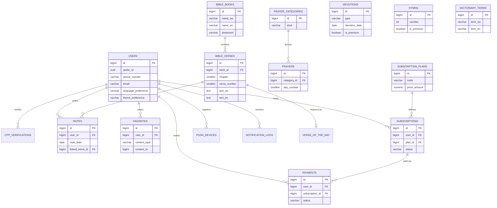

# M-Kristo App — Entity Relationship Diagram

Rendered from `architecture/database_schema.sql`. Paste into any Mermaid
viewer (GitHub renders this automatically) to visualize.

`devotions`, `hymns`, and `dictionary_terms` have no FK relationships to
other content tables (they are looked up standalone, and referenced only
loosely by `favorites.content_id`), so they are omitted from the
relationship arrows above but included with their key columns for
completeness.
